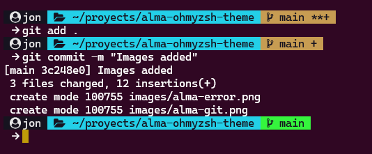
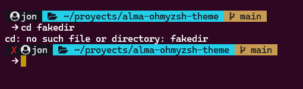

# alma-ohmyzsh-theme

Simple and informative theme for zsh.

Based on the theme made by [RougarouTheme/rougarou-zsh](https://github.com/RougarouTheme/rougarou-zsh).

## Screenshots

<p align="center">
  
</p>

<p align="center">
  
</p>

<p align="center">
  
</p>

## Install

1. Install a [Nerd Font](https://www.nerdfonts.com/)! The theme uses Nerd Font Icons.
2. Copy the `alma.zsh-theme` file into `~/.oh-my-zsh/custom/themes/` folder.
3. Update your .zshrc file to:
  ```
  ZSH_THEME="alma"
  ```
4. Source the .zshrc file or restart the terminal: source `~/.zshrc`

## Tweaks Made
